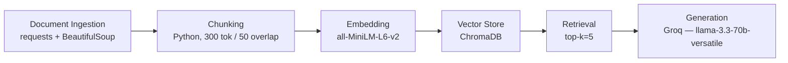

# Project 1 Planning: The Unofficial Guide

> Write this document before you write any pipeline code.
> Your spec and architecture diagram are what you'll use to direct AI tools (Claude, Copilot, etc.) to generate your implementation — the more specific they are, the more useful the generated code will be.
> Update the Retrieval Approach and Chunking Strategy sections if you change your approach during implementation.
> Update this file before starting any stretch features.

---

## Domain

<!-- What domain did you choose? Why is this knowledge valuable and hard to find through official channels? -->

**Domain:** Off-campus housing in Seattle's University District (U-District) for UW students.

**Why it's valuable:** Finding housing in the U-District is one of the highest-stakes decisions a UW student makes — it affects budget, commute, safety, and quality of life. The real questions students have ("Is this landlord responsive?" "Is [building] worth the price?" "Which property managers to avoid?") require lived experience, not brochure copy.

**Why it's hard to find officially:** UW's official housing resources list available units but don't aggregate tenant experiences or flag problem landlords. That knowledge lives in scattered Reddit threads, Yelp reviews, Facebook groups, and word of mouth — across multiple platforms, hard to search, and easy to miss. A RAG system that consolidates this into a single queryable interface fills a real gap.

---

## Documents

<!-- List your specific sources: URLs, subreddit names, forum threads, or file descriptions.
     Aim for at least 10 sources that together cover different subtopics or perspectives within your domain. -->

| # | Source | Description | URL or location |
|---|--------|-------------|-----------------|
| 1 | Yelp — The Kelsey Apartments | 17 student reviews of a U-District Student Housing building; covers pricing, management, and commute | https://www.yelp.com/biz/u-district-student-housing-the-kelsey-apartments-seattle |
| 2 | Yelp — Apex | 25 student reviews; individual leasing model for UW students, mixed feedback on value | https://www.yelp.com/biz/u-district-student-housing-apex-seattle |
| 3 | Yelp — Hub U District | 10 student reviews of a large complex on University Way NE; community amenities, noise | https://www.yelp.com/biz/hub-u-district-seattle-seattle |
| 4 | ApartmentRatings — AVA U District | 14 verified resident reviews; covers staff responsiveness and proximity to campus | https://www.apartmentratings.com/wa/seattle/ava-u-district_9199332346275145274/ |
| 5 | ApartmentRatings — Yugo Seattle Lothlorien | 35 verified resident reviews; candid notes on U-District safety and building upkeep | https://www.apartmentratings.com/wa/seattle/yugo-seattle-lothlorien_206726466398105/ |
| 6 | ApartmentRatings — Campus Apartments | 21 verified resident reviews; mixed on maintenance and deposit disputes | https://www.apartmentratings.com/wa/seattle/campus-apartments_206633369498105/ |
| 7 | ApartmentRatings — U-District Student Housing Lakeview | Verified resident reviews of a student-specific complex on 7th Ave NE | https://www.apartmentratings.com/wa/seattle/u-district-student-housing-lakeview_9199332346275191032/ |
| 8 | The Daily UW — Cost vs. convenience | Feb 2026 article on how students weigh rent price against proximity to campus | https://www.dailyuw.com/article/students-weigh-cost-with-convenience-in-search-for-off-campus-housing-20260213 |
| 9 | The Daily UW — High-rise pricing | Mar 2026 investigation into U-District tower costs; a 407 sq ft studio at The Standard runs $2,700/mo | https://www.dailyuw.com/article/bang-over-buck-the-high-prices-behind-the-u-district-s-newest-high-rises-20260309 |
| 10 | The Daily UW — Renter rights awareness | Mar 2023 article on students not knowing their rights; covers repair timelines and deposit law | https://www.dailyuw.com/news/it-doesn-t-occur-to-people-that-they-have-rights-as-renters/article_2bcdcaf2-bd65-11ed-9910-e72cb52bdf07.html |
| 11 | The Daily UW — Tenant rights guide | Feb 2021 guide to Seattle tenant protections; rent increase notices, habitability, deposit caps | https://www.dailyuw.com/huskymediagroup/article_c7f1fcc2-672d-11eb-8df4-334d70554d88.html |
| 12 | The Daily UW — High-rises scamming students (opinion) | Jan 2024 op-ed calling out LIV, HUB, and Lavender for unresolved maintenance and high rents | https://www.dailyuw.com/opinion/u-district-high-rises-are-scamming-students/article_4b95323c-be66-11ee-9e38-f3b7dfaaaca5.html |
| 13 | The Daily UW — Summer housing costs | Apr 2025 article on students priced out of the U-District over summer; avg studio $1,334/mo | https://www.dailyuw.com/article/high-housing-costs-challenge-uw-students-staying-in-seattle-for-the-summer-20250416 |
| 14 | The Daily UW — The ugly side of UW housing | Apr 2026 article examining problems in UW on-campus and U-District housing | https://www.dailyuw.com/article/the-ugly-side-of-uw-housing-20260417 |
| 15 | UW Off-Campus Housing Marketplace | UW Student Media's official listing board; includes tenant resources and housing search tools | https://offcampushousing.uw.edu/listing |
| 16 | UW IELP Off-Campus Housing Guide | UW's official guide covering scam warnings, tenant rights, neighborhoods, and lease basics | https://www.ielp.uw.edu/life-at-the-uw/housing/off-campus-housing |
| 17 | Tripalink — U-District Apartment Guide | Student housing guide covering U-District neighborhoods, pricing, and red flags (mold, pests) | https://tripalink.com/blog/student-housing-in-u-district-your-complete-apartment-guide |
| 18 | r/udub — housing threads | UW subreddit; search "housing apartment" — pull 2–3 specific threads with student advice | https://www.reddit.com/r/udub/search/?q=housing+apartment&sort=top |
| 19 | r/Seattle — U-District housing threads | Seattle subreddit; search "university district housing" — pull 2–3 threads on landlord experiences | https://www.reddit.com/r/Seattle/search/?q=university+district+housing+apartments&sort=top |

---

## Chunking Strategy

<!-- How will you split documents into chunks?
     State your chunk size (in tokens or characters), overlap size, and explain why those
     numbers fit the structure of your documents.
     A review-heavy corpus warrants different chunking than a long FAQ. -->

**Chunk size:** 300 tokens

**Overlap:** 50 tokens

**Reasoning:** Most of the corpus is short reviews — a full Yelp or ApartmentRatings review fits in roughly 100–250 tokens, so 300 keeps each review intact as one chunk rather than splitting it mid-thought. The longer Daily UW articles and the Tripalink guide will get split, and 50 tokens of overlap is enough to keep a sentence from losing its context at a chunk boundary without creating too much noise.

---

## Retrieval Approach

<!-- Which embedding model are you using (e.g., all-MiniLM-L6-v2 via sentence-transformers)?
     How many chunks will you retrieve per query (top-k)?
     If you were deploying this for real users and cost wasn't a constraint, what tradeoffs
     would you weigh in choosing a different embedding model — context length, multilingual
     support, accuracy on domain-specific text, latency? -->

**Embedding model:** `all-MiniLM-L6-v2` via sentence-transformers. It's fast, runs locally without an API key, and handles short review-length text well — which matches most of this corpus.

**Top-k:** 5. Most questions are specific enough that 5 chunks gives the generator enough material to synthesize a good answer without flooding it with noise. If retrieval quality feels weak during evaluation, I'll bump to 7.

**Production tradeoff reflection:** For real users I'd look hard at `text-embedding-3-small` from OpenAI — better accuracy on domain-specific text, longer context window (8191 tokens vs. 256 for MiniLM), and still relatively cheap at $0.02/1M tokens. The main tradeoff is latency and API dependency vs. the local model's zero marginal cost. For a housing guide where queries are in English and the corpus is English-only, multilingual support isn't a priority — so I'd skip models like Cohere Embed Multilingual unless the audience shifts.

---

## Evaluation Plan

<!-- List your 5 test questions with their expected correct answers.
     Questions should be specific enough that you can judge whether the system's response
     is right or wrong. "What are good dining halls?" is too vague.
     "What do students say about wait times at [dining hall name] during lunch?" is testable. -->

| # | Question | Expected answer |
|---|----------|-----------------|
| 1 | What do students say about maintenance responsiveness at Hub U District? | Reviews mention slow or unresolved maintenance requests; op-ed calls it out specifically |
| 2 | Which U-District landlords or buildings have the most complaints about deposit disputes? | ApartmentRatings reviews for Campus Apartments mention deposit and maintenance issues |
| 3 | How much should I expect to pay for a studio apartment in the U-District? | Sources cite ~$1,334/mo avg studio (summer 2025); The Standard at $2,700/mo for 407 sq ft |
| 4 | What rights do I have as a tenant in Seattle if my landlord doesn't make repairs? | Daily UW tenant rights articles cover repair timelines, habitability standards, and deposit law |
| 5 | Is it worth living in a U-District high-rise vs. a smaller building? | Multiple sources contrast amenity-heavy towers (high cost, noise, unresolved issues) vs. smaller buildings (cheaper, more responsive landlords) |

---

## Anticipated Challenges

<!-- What could go wrong? Name at least two specific risks with reasoning.
     Consider: noisy or inconsistent documents, missing source attribution, off-topic
     retrieval, chunks that split key information across boundaries. -->

1. **Generic retrieval across buildings.** Reviews tend to use the same phrases regardless of which property they're talking about — "management is slow," "great location," "thin walls." A query about one building could pull back chunks about a completely different one. To help, I'll include the building name in each chunk's text and metadata so the embedding has something specific to latch onto.

2. **Scraping failures.** Yelp blocks scrapers, and ApartmentRatings pages sometimes return partial content or a 403. If a source silently fails, I won't know the corpus has gaps unless I check. I'll log how many chunks came from each source at ingest time, and fall back to manual copy-paste for anything that won't load.

---

## Architecture

---

## AI Tool Plan

<!-- For each part of the pipeline below, describe:
     - Which AI tool you plan to use (Claude, Copilot, ChatGPT, etc.)
     - What you'll give it as input (which sections of this planning.md, which requirements)
     - What you expect it to produce
     - How you'll verify the output matches your spec

     "I'll use AI to help me code" is not a plan.
     "I'll give Claude my Chunking Strategy section and ask it to implement chunk_text()
     with my specified chunk size and overlap" is a plan. -->

**Milestone 3 — Ingestion and chunking:**
I'll give Claude the Documents table and the Chunking Strategy section and ask it to implement `load_documents()` and `chunk_text()` — 300 token chunks, 50 token overlap, building name included in each chunk's text. I'll verify by checking chunk counts per source and manually reading a few chunks to make sure reviews aren't split mid-sentence.

**Milestone 4 — Embedding and retrieval:**
I'll give Claude the Retrieval Approach section and the Architecture diagram and ask it to implement `embed_chunks()` using all-MiniLM-L6-v2 and `retrieve()` using ChromaDB returning top-5 chunks with metadata. I'll verify by running the 5 evaluation questions and confirming the returned chunks are actually about the right building or topic.

**Milestone 5 — Generation and interface:**
I'll give Claude the Architecture diagram, the Evaluation Plan, and the Groq model name and ask it to implement the prompt template, the Groq API call, and a basic CLI interface. I'll verify by running all 5 test questions end-to-end and checking that answers don't include details that aren't in the retrieved chunks.
